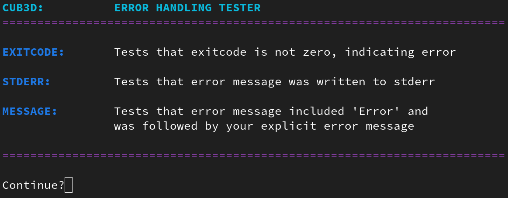

# cub3d-error-tester

Basic error handling tester for 42 cub3D project. Remember to edit script's user parameters at the top to match your project.

Since tester was designed to check error handling in pre-initialization phase, it is recommended to disable mlx init for testing purposes.

Tests:

For executable
- Too few arguments
- Too many arguments

For cub file
- File is empty

For cub file / textures
- Argument is folder
- File does not exist
- File has no name
- File has no extension
- File has bad extension
- No read permission

For colors / textures
- Element is missing
- Same element twice
- Invalid identifier
- Invalid separator

For colors
- Invalid amount of values
- Invalid values
- Extra commas

For map
- Map does not exist
- Invalid dimensions
- Empty lines
- No closed walls
- No or too many player(s)
- Invalid characters
